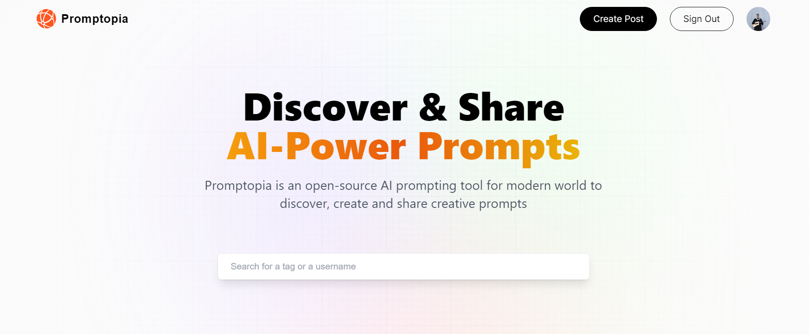
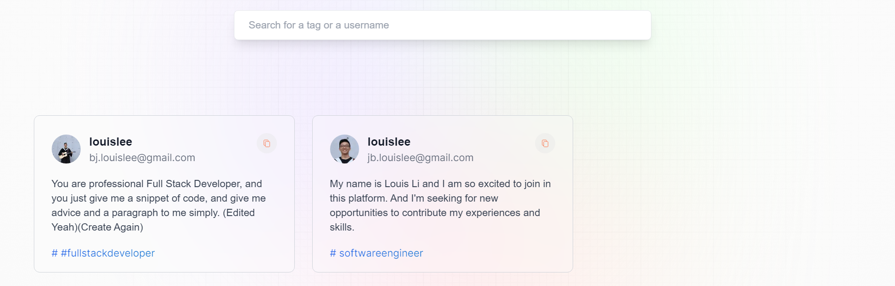
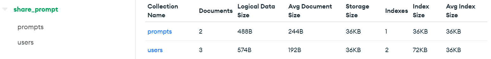
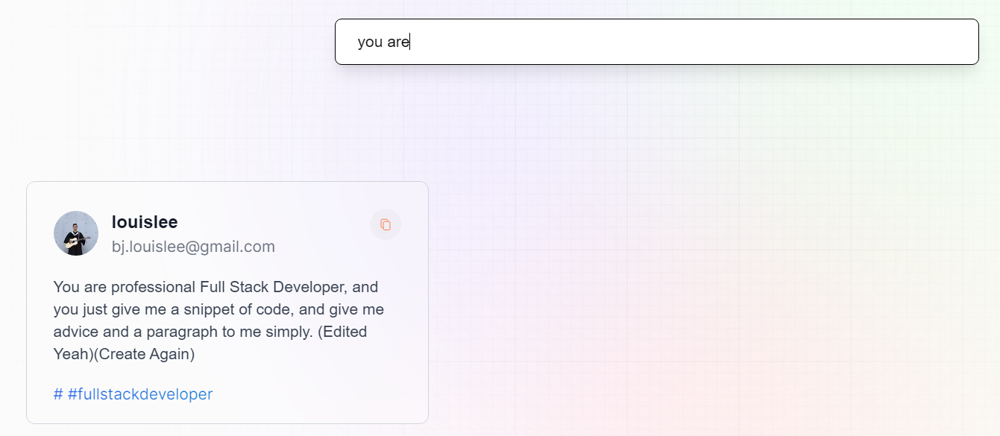
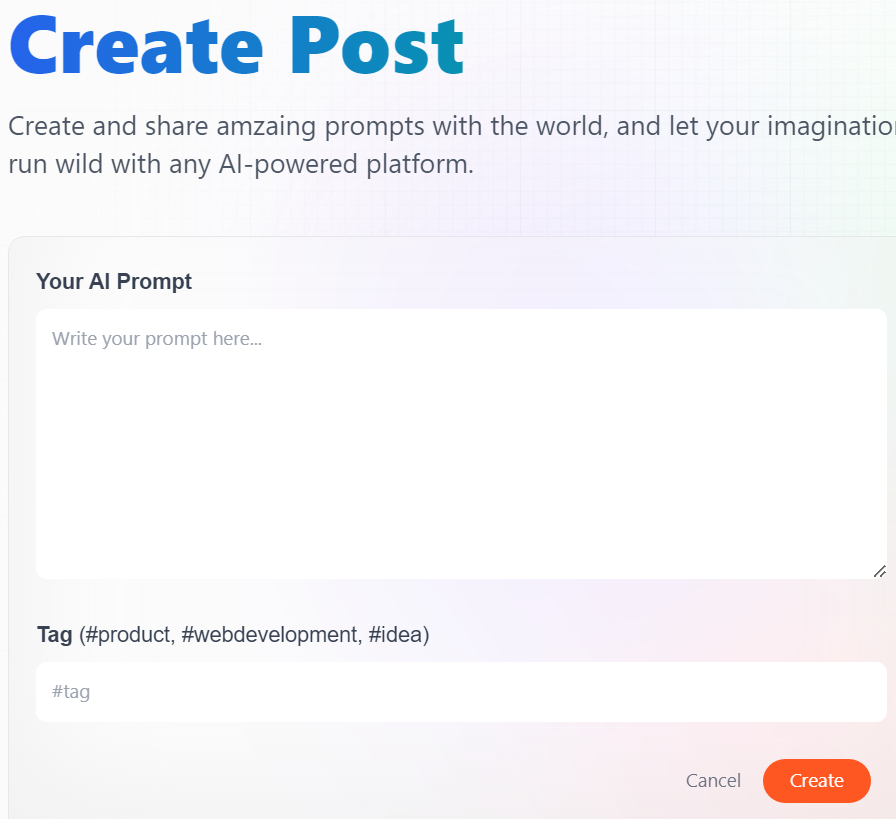
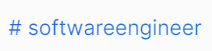
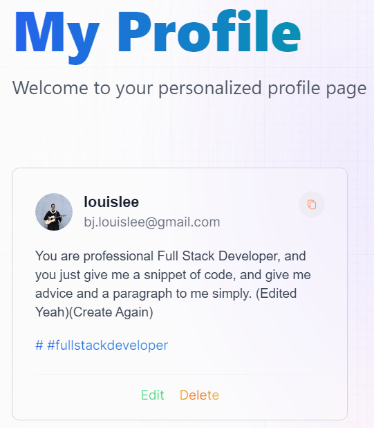

# Newsfeed Web Application

Welcome to the Newsfeed Web Application! This web application allows users to create posts, search for posts, and interact with the community.




## Features

- **Built with**: React.js, Next.js, Tailwind CSS, MongoDB
- **Authentication**: Google OAuth login with `useSession()` for user authentication
- **State Management**: Utilizes `<Provider/>` for managing user information
- **Database**: MongoDB with Mongoose for storing user details and posts

- **Search Functionality**: Search bar to find posts by name, content, and tags

- **Tag Functionality**: Auto-suggest tags for easy post categorization


- **Post Management**: Edit and delete functions for user posts


## Getting Started

### Prerequisites

- Node.js and npm installed
- MongoDB database set up
- Google OAuth credentials

### Installation

1. Clone the repository:

   ```bash
   git clone https://github.com/louisleedev/Promptopia.git
   ```
2. Install dependencies:

    ```bash
    cd Promptopia
    npm install
    ```
3. Set up environment variables:
Create a .env file in the root directory with the following:

    ```env
    MONGODB_URI=your_mongodb_uri
    GOOGLE_OAUTH_CLIENT_ID=your_google_oauth_client_id
    GOOGLE_OAUTH_CLIENT_SECRET=your_google_oauth_client_secret
    ```
4. Run the application:

    ```bash
    npm run dev
    ```
The app will be running at http://localhost:3000.

##Usage
1. Visit the application in your browser.

2. Log in using Google OAuth.

3. Explore and use the various features such as creating posts, searching, and managing posts.

##Contributing
Contributions are welcome! If you find any issues or have suggestions for improvement, feel free to open an issue or submit a pull request.